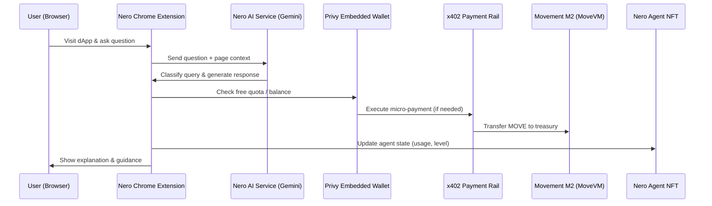
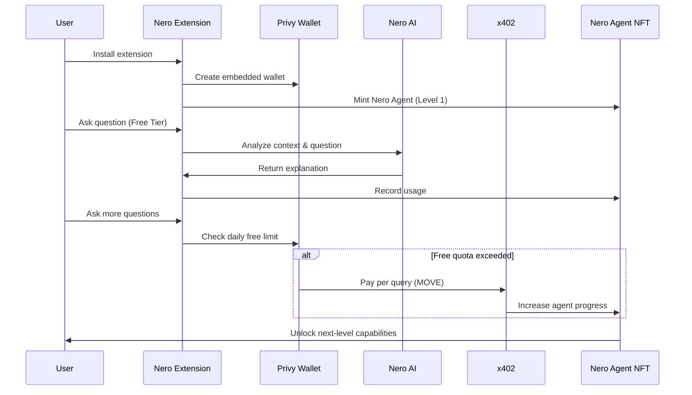
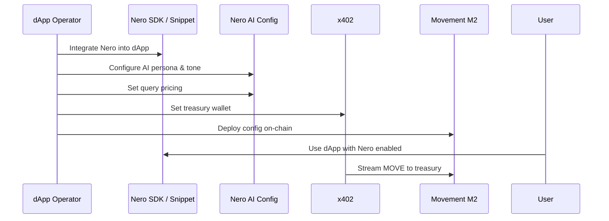

# Nero — AI-Powered Web3 Companion

**Learn Web3 as You Use It. Pay Only for Real Value.**

## Overview

**Nero** is an **AI-powered Web3 onboarding companion** optimized for the
**Movement Network (M2, MoveVM)** ecosystem.

Nero helps users understand complex Web3 concepts and interact with dApps
(such as DEXs, lending protocols, and Move-based applications) **in real time**,
directly within the context of what they are doing.

Instead of learning Web3 through documentation, tutorials, or expensive courses,
Nero enables users to **learn by using Web3**, guided by an AI companion that explains each step as it happens.

## Why Nero?

Web3 adoption fails not because users lack interest,
but because **help arrives too late**.

* Wallets, gas fees, approvals, and transactions overwhelm users
* Tutorials are generic and disconnected from real usage
* Courses are expensive and abandoned early
* Protocols spend heavily on onboarding, yet lose most users

**Nero solves this by becoming a real-time guide inside the Web3 experience itself.**

## Value Proposition

### 1. Learn for Free, Pay for Value

* Every user receives **daily free questions**
* After the free quota, users pay **per query** using small amounts of **MOVE**
* No subscriptions, no upfront commitment
* Users only pay **after value is delivered**

This model dramatically reduces onboarding friction and enables natural conversion.

### 2. Asset-Backed Learning

* User activity (questions, learning, payments) is accumulated into a
  **Nero Agent NFT**
* Learning progress becomes **on-chain growth**
* As the agent evolves, new capabilities are unlocked

Learning is no longer disposable—it becomes an asset.

### 3. Native Integration for Builders

* Developers can integrate Nero into their dApps using:
  * A lightweight SDK, or
  * A simple HTML snippet
* No need to build AI infrastructure
* Instantly adds:
  * User onboarding
  * In-app education
  * A new monetization layer

## Architecture

Nero is designed as a modular, agent-native system combining AI inference, micro-payments, and on-chain identity. The following diagrams illustrate how users, builders, and protocols interact with Nero.

> Key Points

- Context-aware AI runs off-chain
- Payments are streamed via x402
- Learning progress is persisted on-chain as NFT state

## Core Components

### Nero Sentinel (AI Chat)

Nero Sentinel is an intelligent AI assistant powered by
**Google Gemini (gemini-3-flash-preview)**.

It can explain:
* Move language concepts
* Smart contract behavior
* Transaction flows
* DeFi mechanics and liquidity strategies
* Common risks (approvals, slippage, failed transactions)

All explanations are **context-aware** and delivered in real time.

### Simulator Core (Live Demo)

#### User View

* Simulates real dApp usage with Nero assistance
* Users can:
  * Ask questions
  * See real-time guidance
  * Observe Nero Agent NFT progression
* Demonstrates:
  * Free → Paid conversion
  * Agent evolution flow

#### Admin Control

* dApp operators can configure:
  * AI persona and tone
  * Query pricing
  * Treasury wallet
  * Revenue distribution
* Enables protocol-specific onboarding experiences

### Dynamic NFT System (Nero Agent)

Each user owns a **Nero Agent NFT**, which evolves over time.
* Levels progress from **Newbie → Explorer → Strategist → Master**
* Each level unlocks:
  * Enhanced intelligence
  * Advanced analysis features
  * Unique visual identity

This is not a cosmetic NFT—it represents a **functional AI agent**.

### x402 Protocol (Micro-Payments)

Nero uses **x402** to enable real-time micro-payments.
* Each query triggers a **direct MOVE transfer** to the treasury
* No subscriptions, no batching delays
* Enables sustainable Pay-per-Query economics for AI agents

This makes Nero a practical example of **agent-native payment infrastructure**.

## Target Audience

### Users

* Web3 newcomers entering the Move ecosystem
* Advanced users who want real-time explanations and safety guidance
* Anyone interacting with DeFi, NFTs, or smart contracts

### Builders

* dApp teams looking to reduce onboarding drop-off
* Protocols seeking a **completion-based onboarding model**
* Builders who want to add AI-driven education and monetization quickly

## Vision

Nero is more than a chatbot.

It is:
* An onboarding layer for Web3
* A real-world example of agentic economies
* A bridge between AI, payments, and on-chain identity

**Nero turns Web3 usage into understanding, and understanding into ownership.**

## Getting Started (Coming Soon)

* Chrome Extension installation
* Developer SDK & integration guide
* Live demo on Movement M2

## Contact

* Website: Coming soon
* GitHub: This repository
* Built for the **Movement ecosystem**
