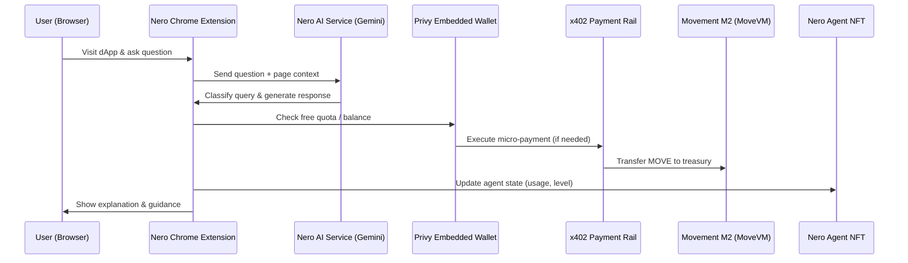
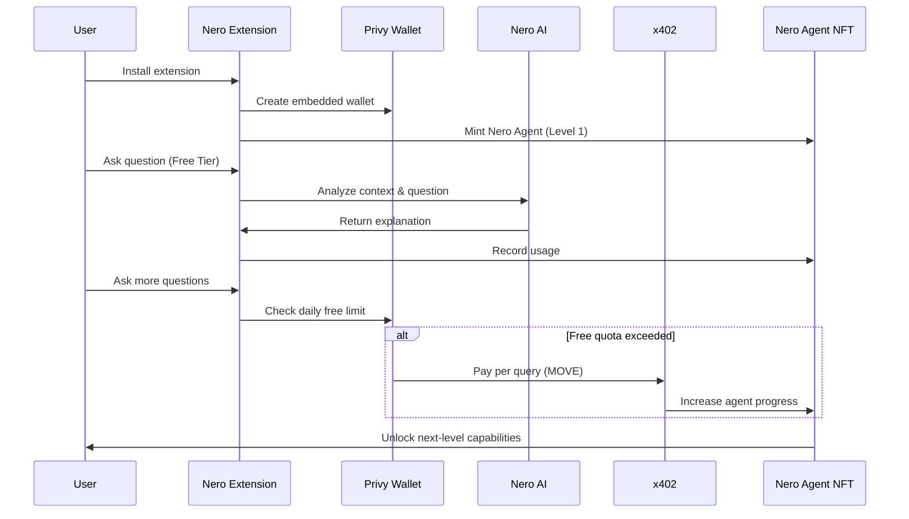
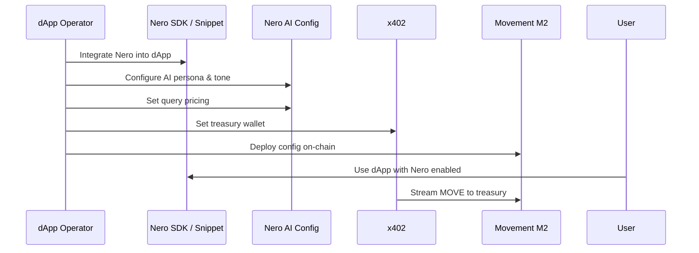

# Nero: AI-Powered Web3 Companion

**Learn Web3 as You Use It. Pay Only for Real Value.**

[Smart Contract](https://github.com/Joseph-hackathon/Nero/tree/main#smart-contract-move-language) | [Privy](https://github.com/Joseph-hackathon/Nero/tree/main#privy-authentication-integration) | [x402 Protocol](https://github.com/Joseph-hackathon/Nero/tree/main#x402-protocol-micro-payments-1)

## Overview

**Nero** is an **AI-powered Web3 onboarding companion** optimized for the
**Movement Network (M2, MoveVM)** ecosystem.

Nero helps users understand complex Web3 concepts and interact with dApps
(such as DEXs, lending protocols, and Move-based applications) **in real time**,
directly within the context of what they are doing.

Instead of learning Web3 through documentation, tutorials, or expensive courses,
Nero enables users to **learn by using Web3**, guided by an AI companion that explains each step as it happens.

## Why Nero?

Web3 adoption fails not because users lack interest,
but because **help arrives too late**.

* Wallets, gas fees, approvals, and transactions overwhelm users
* Tutorials are generic and disconnected from real usage
* Courses are expensive and abandoned early
* Protocols spend heavily on onboarding, yet lose most users

**Nero solves this by becoming a real-time guide inside the Web3 experience itself.**

## Value Proposition

### 1. Learn for Free, Pay for Value

* Every user receives **daily free questions**
* After the free quota, users pay **per query** using small amounts of **MOVE**
* No subscriptions, no upfront commitment
* Users only pay **after value is delivered**

> This model dramatically reduces onboarding friction and enables natural conversion.

### 2. Asset-Backed Learning

* User activity (questions, learning, payments) is accumulated into a
  **Nero Agent NFT**
* Learning progress becomes **on-chain growth**
* As the agent evolves, new capabilities are unlocked

> Learning is no longer disposable it becomes an asset.

### 3. Native Integration for Builders

* Developers can integrate Nero into their dApps using:
  * A lightweight SDK, or
  * A simple HTML snippet
* No need to build AI infrastructure
* Instantly adds:
  * User onboarding
  * In-app education
  * A new monetization layer

## Architecture

Nero is designed as a modular, agent-native system combining AI inference, micro-payments, and on-chain identity.
The following diagrams illustrate how users, builders, and protocols interact with Nero.


> Key Points

- Context-aware AI runs off-chain
- Payments are streamed via x402
- Learning progress is persisted on-chain as NFT state

## Core Components

### Nero Sentinel (AI Chat)

Nero Sentinel is an intelligent AI assistant powered by
**Google Gemini (gemini-3-flash-preview)**.

It can explain:
* Move language concepts
* Smart contract behavior
* Transaction flows
* DeFi mechanics and liquidity strategies
* Common risks (approvals, slippage, failed transactions)

> All explanations are **context-aware** and delivered in real time.

### Simulator Core (Live Demo)

#### User View



* Simulates real dApp usage with Nero assistance
* Users can:
  * Ask questions
  * See real-time guidance
  * Observe Nero Agent NFT progression
* Demonstrates:
  * Free → Paid conversion
  * Agent evolution flow

#### Admin Control



* dApp operators can configure:
  * AI persona and tone
  * Query pricing
  * Treasury wallet
  * Revenue distribution
* Enables protocol-specific onboarding experiences

### Dynamic NFT System (Nero Agent)

Each user owns a **Nero Agent NFT**, which evolves over time.
* Levels progress from **Newbie → Explorer → Strategist → Master**
* Each level unlocks:
  * Enhanced intelligence
  * Advanced analysis features
  * Unique visual identity

> This is not a cosmetic NFT it represents a **functional AI agent**.

### x402 Protocol (Micro-Payments)

Nero uses **x402** to enable real-time micro-payments.
* Each query triggers a **direct MOVE transfer** to the treasury
* No subscriptions, no batching delays
* Enables sustainable Pay-per-Query economics for AI agents

> This makes Nero a practical example of **agent-native payment infrastructure**.

## How to use tech

### Smart Contract (Move Language)

Nero uses Move smart contracts on the Movement Network for NFT minting and management.

#### Contract Structure

**Key Functions:**
- `initialize`: Collection initialization (admin only)
- `create_nft`: NFT creation (admin only)
- `mint_nft`: User NFT minting
- `process_payment`: Payment processing and event emission

**Contract Code:**
```move
module nero_protocol::nft {
    struct NFTMetadata has store, drop {
        name: String,
        description: String,
        image_uri: String,
        admin_address: address,
        price_per_question_move: u64,
        price_per_question_usdt: u64,
        price_per_question_usdc: u64,
    }
    
    #[event]
    struct MintEvent has drop, store {
        token_id: String,
        minter: address,
        admin_address: address,
    }
}
```

#### Integration in Project

The smart contract is integrated with the frontend via `services/nftService.ts`:

1. **NFT Minting**: `mintNeroAgent()` calls the backend API to generate transactions, which are signed and submitted via the user's wallet.

2. **NFT Creation (Admin)**: `buildCreateNFTTransaction()` is used in the admin console to create NFTs.

3. **Transaction Processing**: The backend API interacts with the Move contract to create blockchain transactions.

**Related Files:**
- Contract code: [`contracts/sources/nft.move`](./contracts/sources/nft.move)
- Service layer: [`services/nftService.ts`](./services/nftService.ts)
- Type definitions: [`types.ts`](./types.ts)

**Usage Example:**
```typescript
// Mint NFT
const mintResponse = await mintNeroAgent(
  walletAddress,
  platformId,
  platformName
);

// Admin NFT creation
const transaction = await buildCreateNFTTransaction(
  tokenName,
  tokenDescription,
  imageUri,
  priceMove,
  priceUSDT,
  priceUSDC
);
```

### Privy Authentication Integration

Nero uses **Privy SDK** for user authentication and wallet management.

#### Privy Architecture

**Key Components:**

1. **PrivyProvider** (`PrivyContext.tsx`):
   - Wraps Privy SDK in React Context
   - Provides authentication state, user info, and wallet data globally
   - Accessible via custom hook `usePrivy`

2. **Configuration** (`index.tsx`):
   - Login methods: Email, Google, Wallet
   - Automatic Embedded Wallet creation
   - External wallet support (Nightly, etc.)

**Privy Integration Code:**
```typescript
<PrivyProvider
  appId={import.meta.env.VITE_PRIVY_APP_ID}
  config={{
    loginMethods: ['email', 'wallet', 'google'],
    embeddedWallets: {
      createOnLogin: 'users-without-wallets',
      noPromptOnSignature: true
    },
    externalWallets: {
      coinbaseWallet: {
        connectionOptions: 'smartWalletOnly',
      },
    },
  }}
>
  <App />
</PrivyProvider>
```

#### Usage in Project

**In App.tsx:**

1. **Authentication State Management**:
```typescript
const { authenticated, user, login, logout, ready } = usePrivy();
```

2. **Get Wallet Address**:
```typescript
const walletAddress = user?.wallet?.address;
```

3. **Login/Logout**:
```typescript
<button onClick={login}>Get Started</button>
await logout();
```

4. **Network Detection & Switching**:
   - Automatically attempts to switch to Movement Testnet after Privy connection
   - Auto-detects network changes via event listeners for Nightly wallet

**Key Features:**
- **Auto wallet creation**: Embedded Wallet auto-creation for users without wallets
- **Multiple login methods**: Email, Google, external wallets
- **Network management**: Automatic Movement Testnet switching and detection
- **State persistence**: User state stored in localStorage (per wallet address)

**Related Files:**
- Privy Context: [`PrivyContext.tsx`](./PrivyContext.tsx)
- App entry point: [`index.tsx`](./index.tsx)
- Main app: [`App.tsx`](./App.tsx)

### x402 Protocol (Micro-Payments)

Nero uses the **x402 protocol** to enable real-time micro-payments for AI queries on Movement Network.

#### Integration

The x402 protocol is integrated via `services/paymentService.ts`:

1. **Payment Execution**: `executePayment()` handles micro-payments by sending MOVE tokens directly to the treasury wallet via x402 endpoint.
2. **Balance Checking**: `checkBalance()` queries Movement RPC to get the user's MOVE token balance.
3. **Payment Validation**: `validateSufficientBalance()` ensures users have enough balance before processing payments.

**Payment Flow:**
```typescript
// Execute payment via x402
const result = await executePayment({
  amount: pendingPayment.amount,
  token: "MOVE",
  senderWallet: userState.walletAddress,
  recipientWallet: treasuryWallet,
  metadata: {
    type: "query",
    platformId: activeDapp,
    description: "AI query payment"
  },
});
```

**Key Features:**
- **Real-time payments**: Direct MOVE transfers per query (no batching)
- **Multi-token support**: MOVE, USDC, USDT
- **Payment metadata**: Tracks query type, platform ID, and descriptions
- **Balance management**: Automatic balance checking and validation

**Related Files:**
- Payment service: [`services/paymentService.ts`](./services/paymentService.ts)
- Payment modal: [`components/PaymentModal.tsx`](./components/PaymentModal.tsx)
- App integration: [`App.tsx`](./App.tsx) (see `handlePaymentConfirm`)

**Configuration:**
- x402 endpoint: `VITE_X402_ENDPOINT` (default: `https://x402.movement.network/api/pay`)
- Treasury wallet: `VITE_PAYMENT_WALLET_ADDRESS`

## Target Audience

### Users

* Web3 newcomers entering the Move ecosystem
* Advanced users who want real-time explanations and safety guidance
* Anyone interacting with DeFi, NFTs, or smart contracts

### Builders

* dApp teams looking to reduce onboarding drop-off
* Protocols seeking a **completion-based onboarding model**
* Builders who want to add AI-driven education and monetization quickly

## Vision

Nero is more than a chatbot.

It is:
* An onboarding layer for Web3
* A real-world example of agentic economies
* A bridge between AI, payments, and on-chain identity

**Nero turns Web3 usage into understanding, and understanding into ownership.**

## Getting Started (Coming Soon)

* Chrome Extension installation
* Developer SDK & integration guide
* Live demo on Movement M2

## Contact

* Website: [Nero](https://nero-wu3a.vercel.app/)
* GitHub: This repository
* Built for the **Movement ecosystem**
